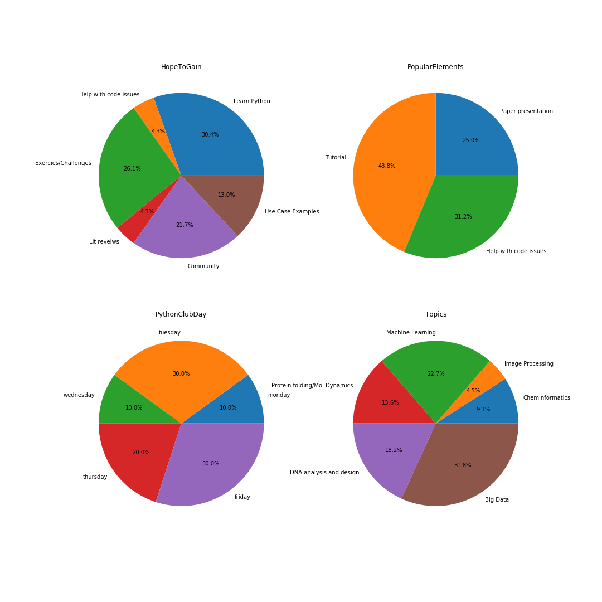

### MIB Python Club! :snake:

This is the repository for MIB Python club!

### 🚧🚧 Early construction 🚧🚧

# We have:

### Meetings:
* **Every Friday @ 12**
* **Content includes:** Tutorials, presentations on software, paper presentations **and more!**
* **Interested in presenting material?** get in touch @ [james.engleback@postgrad.manchester.ac.uk](james.engleback@postgrad.manchester.ac.uk)
### Tutorials:
* **[Some basic python bits](https://github.com/UoMMIB/Python-Club/blob/master/Tutorials/BasicBitsPython.ipynb)**  -Introduction to jupyter notebooks and some basic syntax. Use what we've learned to make a DNA translator.
* **[Simple Data Handling](https://github.com/UoMMIB/Python-Club/blob/master/Tutorials/IntroToDataWranglingWithPandas.ipynb)** - Download live COVID-19 infection rate data and learn to handle ```csv``` files, and make simple plots.
* **[Basic Cheminformatics](https://github.com/UoMMIB/Python-Club/blob/master/Tutorials/IntroToCheminformatics.ipynb)** - Use the PubChem API to find drug candidates currently in clinical trails for COVID-19 treatment. Find and plot their physical properties. Visualise a PDB structure in the notebook. Introduction to the ```rdkit``` cheminformatics module.
* [**Basic Machine learning**](https://github.com/UoMMIB/Python-Club/tree/master/Tutorials/PL-Pro) - a series of notebooks to [acquire bioassay data](https://github.com/UoMMIB/Python-Club/blob/master/Tutorials/PL-Pro/PL-Pro-Part1-DataAcquisition.ipynb) ✅, use the cheminformatics package ```rdkit``` to explore the data 🚧, build and evaluate a simple machine learning model 🚧 build a better machine learning model 🚧 predict the efficacy of compounds in the [Broad DRUG REPURPOSING HUB](https://www.broadinstitute.org/drug-repurposing-hub) 🚧

### Resources
I've dumped some useful resources into [**this file**](https://github.com/UoMMIB/Python-Club/tree/master/Resoruces) for topics including, but not limited to:
* Links to Tutorials
* Videos
* Cheat sheets
* Curated lists of machine learning + biology papers


### Polls
At our **round table** meeting on Wednesday 20th May, we took some polls. Here are the results:

Check [**Polls**](https://github.com/UoMMIB/Python-Club/tree/master/Polls) for the csvs and the [notebook](https://github.com/UoMMIB/Python-Club/blob/master/Polls/Polls.ipynb) to see how the plots were generated.
